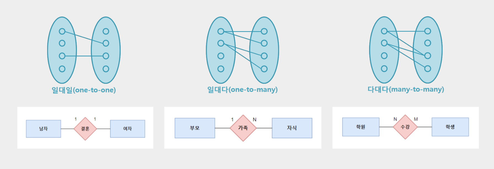
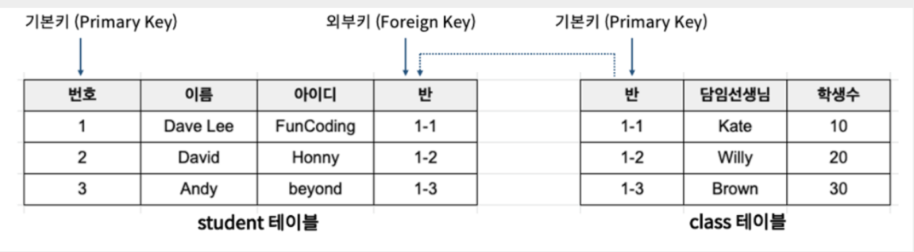
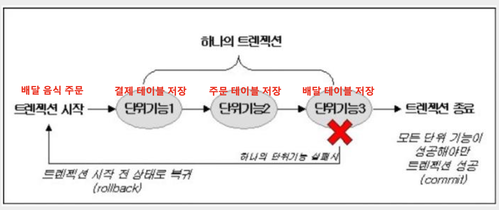

# 데이터베이스, 데이터 모델링, SQL

데이터베이스는 여러 사람이 공유하여 사용할 목적으로 체계화, 통합, 관리하는 데이터의 집합, 데이터베이스 관리 시스템(DBMS)에 의해 제어된다.

## 관계형 데이터베이스(RDBMS)

---

테이블 형태로 데이터를 관리, 테이블 간의 관계를 매핑한다. 데이터베이스는 스키마라 불리기도 하며 각 데이터베이스 내에는 여러개의 테이블이 있고, 관계를 맺고 있다.

### 관계형 데이터베이스 관계

일대일, 일대다, 다대다

### 관계형 데이터베이스 키(Key)

기본키(Primary Key): 튜플(가로줄)을 유일하게 구별할 수 있게 하는 속성(중복 x, null x)

외래키(Foreign Key): 다른 테이블의 기본키를 참조하는 속성

유니크 키(Unique Key): 중복을 허용하지 않는 열에 지정하여 적용

## 비관계형 데이터베이스(NoSQL)

---

DB 구조에 대한 정의가 없는 여러 유형의 데이터베이스를 의미한다. 종류에는 Key-value, Wide-Column, Document, Graph 등이 있다.

### 관계형 데이터베이스와 비관계형 데이터베이스의 차이

- 저장(insert), 수정(update)시 차이
  - 관계형 데이터베이스는 데이터를 저장할 때 용량을 적게 차지하고, 중복되는 데이터가 적다. 저장과 수정할시 관계형 데이터베이스가 유리하다
- 조회(select)시 차이
  - 관계형 데이터베이스는 테이블 관계에 맞추어 조회, 비관계형 데이터베이스는 관계를 생각하지 않고 곧바로 조회가 가능하다.

## 데이터 모델링

---

### 관계형 데이터 모델링

관계형 데이터베이스는 정형화된 구조를 갖기에 테이블, 테비을 간의 관계를 설계하는 작업이 필요하다.

개념적 데이터 모델링 → 논리적 데이터 모델링 → 물리적 데이터 모델링

### 개념적 데이터 모델링

현실의 업무를 분해하여, 데이터 상의 개념을 뽑아내는 일

산출물: ER 다이어그램

### 논리적 데이터 모델링

만들어진 개념적 데이터 설계를 관계형 DB에 맞게 설계

산출물: 테이블 관계도

### 물리적 데이터 모델링

설계된 데이터를 바탕으로 실제 테이블을 생성하고 성능 향상 고려, 서비스 운영 후 점진적으로 수정해 나가는 과정

반정규화(역정규화), 인덱스 등

산출물: SQL 쿼리문

### 정규화

관계형 데이터베이스에서 중복을 최소화하기 위해 구조화하는 작업

중규화는 1NF부터 6NF까지 있지만, 일반적으로 3NF까지만 진행한다. 정규화를 진행할수록 중복을 줄어드나 조회가 어려워진다는 단점이 있다.

### 제 1 정규화

원자화, 하나의 컬럼에 여러 개의 데이터가 들어갈 때, 새로운 테이블로 분리

### 제 2 정규화

부분 종속성을 제거, 식별자가 아닌 속성들 중에서 주식별자 전체가 아닌 일부 속성에 종속된 속성들을 제거하는 과정

### 제 3 정규화

이행적 종속성을 해결, 주식별자가 아닌 속성들 중에서 종속된 속성을 제거하는 과정이다.

### 인덱스(index)

테이블의 검색(조회) 성능을 높여주는 방법, 특정 행으로 인덱스를 만들어 두면, 해당 행을 조건으로하는 조회 성능 향상

장점: 테이블 조회 속도 향상, 속도 향상으로 인한 전반적인 시스템 부하 감소

단점: 추가 저장공간 필요, 인덱스 관리 작업 필요, 잘못 사용할 경우 역효과(생성, 수정)

인덱스는 생성, 수정이 적고, 조회가 빈번, 컬럼의 중복도가 적을수록 적합하다.

### 모델링 팁

---

### PK 값

모든 테이블에는 INT 데이터로 자동 생성되는 PK 칼럼을 별도로 둘 것, 매핑 테이블도 동일하게 PK를 칼럼에 둘 것

### N:M 관계

N:M 관계는 1:N 관계 2개로 표현

### 네이밍

정해진 네이밍은 없지만, 하나의 ERD 안에서 통일해서 사용

자바에서도 카멜 케이스를 사용하기에 카멜 케이스를 추천한다.

### 생성, 업데이트 일자

모든 테이블에는 생성, 업데이트 일자를 추가해주자.

### 논리 삭제

주요 테이블에는 상태값(ACTIVE, INACTIVE)로 삭제 여부를 나타내자

실제로 데이터를 지우는 것이 아니라 가상으로 데이터를 삭제한 것 처럼 관리를 한다.

### null, default 값

각 칼럼에 맞게 null, default 값을 채워주자, 특히 생성일, 수정일, 상태 값

### 데이터 타입

각 칼럼에 가장 알맞는 데이터 타입을 명시

- 사용하는 DB엔진에 맞는 데이터 타입 확인하기
- URL은 TEXT 타입으로
- 비밀번호는 길이 200 이상으로
- 양수 INT는 INT UNSIGNED 타입으로
- 데이터베이스의 ENUM 데이터 타입 사용은 지양

### 트랜잭션

데이터베이스의 상태를 변환시키는 하나의 논리적 기능을 수행하기 위한 작업의 단위, 트랜잭션은 독립적으로 이루어진다.

### 커넥션 풀

커넥션 풀이라는 곳에 미리 연결된 커넥션을 만들어 놓고 이를 관리 데이터 베이스 연결 통로의 집합

### 데드락(교착상태)

무한히 다음 자원을 기다리게 되는 상태
