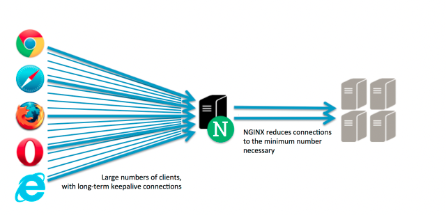
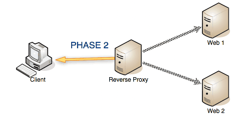
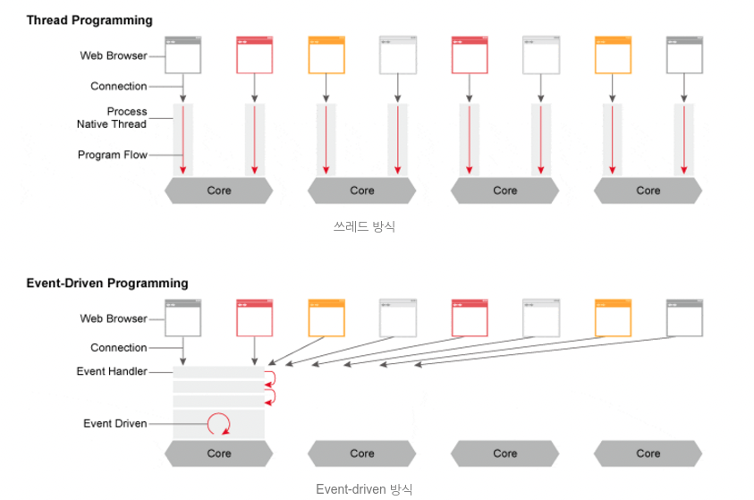

# Nginx

Nginx란 동시접속 처리에 특화된 웹 서버 프로그램이다. Apache보다 동작이 단순하고, 전달자 역할만 하기 때문에 동시 접속 처리에 특화되어 있다. 동시접속자가 700명 이상이라면 서버를 증설하거나 Nginx 환경을 권장한다고 한다. 아파치의 시장 점유율이 매우 높지만 아마존웹서비스 상에서는 시장 점유율이 44%에 달할정도로 가볍고 성능이 좋다고 알려져있다.

### 1. 정적 파일을 처리하는 HTTP 서버로서의 역할

---

웹서버의 역할은 HTML, CSS, Javascript, 이미지와 같은 정보를 웹 브라우저에 전송하는 역할을 한다.

### 2. 응용프로그램 서버에 요청을 보내는 리버스 프록시로서의 역할

---

클라이언트는 가짜 서버에 요청하면 프록시 서버가 배후 서버로부터 데이터를 가져오는 역할을 한다. 여기서 프록시 서버의 역할을 nginx가, 리버스 서버는 응용프로그램 서버가 맡는다. 응용프로그램 서버거 위와 같이 리버스 프록시를 두는 이유는 요청에 대한 버퍼링이 있기 때문이다. 클라이언트가 직접 app 서버에 직접 요청하는 경우, 프로세스 1개가 응답 대기 상태가 되어야만 한다. 따라서 프록시 서버를 둠으로써 요청을 배분하는 역할을 한다.

nginx는 비동기 처리방식(Evnet-Drive) 방식을 채택하고 있다.

### 참고

---

- https://whatisthenext.tistory.com/123
