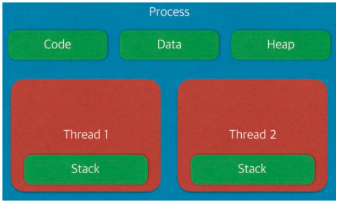

# 운영체제 & 하드웨어

## 운영체제

운영체제는 프로그램들을 실행하는 메인 프로그램이다. 프로그램들을 실행시키기 위해 하드웨어 자원들을 이용하게 되는데, 운영체제는 네트워크나 입출력 장치와 같은 하드웨어를 이용하여 프로그램을 작동시킨다. 운영체제의 여러 구성 요소 중 `커널`이 위와 같은 역할을 담당한다.

## 하드웨어

컴퓨터를 구성하는 하드웨어는 크게 CPU, 메모리, 디스크로 구성되어있다.

- `CPU`는 컴퓨터의 시스템 통제와 프로그램을 위한 계산을 담당한다. 즉, 프로그램이 실행되고 있다는 것은 CPU가 일을 하고 있다는 것이다.
- `메모리`는 임시적인 저장장소의 역할을 한다. CPU의 계산 결과를 저장해주고 프로그램이 실행되는 공간을 제공하는 역할을 한다.
- `디스크`는 정보를 영구적으로 저장하는 역할을 한다.

## 프로세스 & 스레드

---

> 프로세스 : 프로그램을 메모리 상에서 실행중인 작업  
> 스레드 : 프로세스 안에서 실행되는 여러 흐름 단위

-> 기본적으로 프로세스마다 최소 1개의 스레드를 소유하고 있다.

### 프로세스

---

Code : 코드 자체를 구성하는 메모리 영역(프로그램 명령)
Data : 전역변수, 정적변수, 배열 - 초기화된 데이터는 data 영역에 저장 - 초기화 되지 않은 데이터는 bss 영역에 저장
Heap: 동적 할당 시 사용(new(), malloc())
Stack: 지역변수, 매개변수, 리턴 값(임시 메모리 영역)

프로세스가 생성될 때, 기본적으로 하나의 스레드가 같이 생성된다.

-> 프로세스는 자신만의 고유 공간과 자원을 할당받아 사용하는데 반해, 스레드는 다른 스레드와 공간, 자원을 공유하면서 사용하는 차이가 존재한다.

### 프로세스와 스레드 차이

프로세스는 메모리 상에서 실행중인 프로그램을 말하며, 스레드는 이 프로세스 안에서 실행되는 흐름 단위를 말한다. 프로세스마다 최소 하나의 스레드를 보유하고 있고, 각각 별도의 주소공간을 독립적으로 할당 받는다.(code, data, heap, stack)
스레드는 stack만 따로 할당받고 나머지 영역은 스레드끼리 공유한다.

- 프로세스 : 자신만의 고유 공간과 자원을 할당받아 사용한다.
- 스레드 : 다른 스레드와 공간과 자원을 공유하면서 사용한다.

## 멀티프로세스

---

> 하나의 프로그램을 여러 개의 프로세스로 구성하여 각 프로세스가 병렬적으로 작업을 수행하는 것

장점 : 안정성(메모리 침범 문제를 OS 차원에서 해결)
단점 : 각각 독립된 메모리 영역을 가지고 있어, 작업량이 많을 수록 오버헤드가 발생, Context Switching으로 인한 성능 저하

### Context Switching

---

프로세스의 상태 정보를 저장하고 복원하는 일련의 과정이다. 즉, 동작 중인 프로세스가 대기하면서 해당 프로세스의 상태를 보관하고, 대기하고 있던 다음 순번의 프로세스가 동작하면서 이전에 보관했던 프로세스 상태를 복구하는 과정을 말한다.

-> 프로세스는 각 독립된 메모리 영역을 할당받아 사용되므로, 캐시 메모리 초기화와 같은 무거운 작업이 진행되었을 때 오버헤드가 발생한 문제가 있다.

## 멀티 스레드

> 하나의 응용 프로그램에서 여러 스레드를 구성해 각 스레드가 하나의 작업을 처리하는 것

스레드들이 공유 메모리를 통해 다수의 작업을 동시에 처리하도록 해준다.

장점 : 독립적인 프로세스에 비해 공유 메모리만큼의 시간, 자원 손실이 감소, 전역 변수와 정적 변수에 대한 자료 공유 가능

단점 : 안정성 문제, 하나의 스레드가 데이터 공간을 망가뜨리면 모든 스레드가 작동 불능 상태에 빠진다.

-> 멀티 스레드의 안정성에 대한 단점은 Critical Section 기법을 통해 대비해야 한다.
하나의 스레드가 공유 데이터 값을 변경하는 시점에 다른 스레드가 그 값을 읽으려할 때 발생하는 문제를 해결하기 위한 동기화 과정이 필요하다.

### 멀티 프로세스 대신 멀티 슬레드를 사용하는 이유는?

프로세스를 생성하여 자원을 할당하는 시스템 콜이 감소함으로써 자원의 효율적인 관리가 가능하기 때문이다. 프로세스 간의 통신(IPC)보다 스레드 간의 통신 비용이 적게 들어 부담이 감소한다. 다만 멀티 스레드를 사용할 때는 공유 자원으로 인한 문제 해결을 위해 '동기화'에 신경써야 한다.

## 프로세스의 주소 공간

---

> 프로그램이 CPU에 의해 실행된다는 것은 프로세스가 생성되고 메모리에 프로세스 주소 공간이 할당된다는 의미한다.

프로세스 주소 공간은 코드, 데이터, 스택으로 이루어져 있다.

- 코드 Segment : 프로그램 소스 코드 저장
- 데이터 Segment : 전역 변수 저장
- 스택 Segment : 함수, 지역 변수 저장

위와 같이 구역을 나눈 이유는 최대한 데이터를 공유하며 메모리 사용량을 줄여야 하기 때문이다.
Code는 같은 프로그램 자체에서는 모두 같은 내용이기에 따로 관리하여 공유하지만 Stack과 Data를 나눈 이유는 스택 구조의 특성과 전역 변수의 활용성을 위해서다.

프로그램의 함수와 지역 변수는 LIFO(가장 나중에 들어간 것이 먼저 나온다.) 특성을 가진 스택에서 실행된다.

### 참고

- https://github.com/gyoogle/tech-interview-for-developer
- https://gyoogle.dev/blog/interview/%EC%9A%B4%EC%98%81%EC%B2%B4%EC%A0%9C.html
