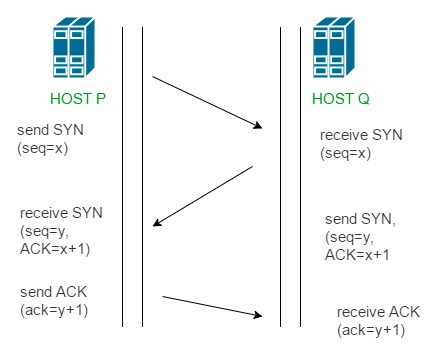

# TCP

> TCP는 연속성보다 신뢰성있는 전송이 중요할 때 사용하는 프로토콜이다.

## TCP 특징

---

- 연결 지향 방식이다.
- 3-way handshaking 과정을 통해 연결을 설정하고 4-way handshaking을 통해 해제한다.
- 흐름 제어 및 혼잡 제어
- 높은 신뢰성 보장
- UDP보다 느린 속도
- 전이중(Full-Duplex), 점대점(Point to Point) 방식

## TCP 서버의 특징

- 서버소켓은 연결만을 담당한다.
- 연결과정에서 반환된 클라이언트 소켓은 데이터의 송수신에 사용된다.
- 서버와 클라이언트는 1대1로 연결된다.
- 스트림 전송으로 전송 데이터의 크기가 무제한이다.
- 패킷에 대한 응답을 해야하기에 성능이 낮다.
- Streaming 서비스에 불리하다.(손실된 경우 재전송 요청을 하기에)

## 3 way handshake & 4 way handshake

---

> 연결과 해제 과정을 말한다.

## 3 way handshake - 연결 성립

---

> TCP는 정확한 전송을 보장해야하기에 통신에 앞서 논리적인 접속을 성립하고자 3 way handshake 과정을 진행한다.

1. 클라이언트가 서버에게 SYN 패킷을 보낸다. (sequence : x)
2. 서버가 SYN(x)를 받고, 클라이언트에게 잘 전송 받았다는 신호인 ACK와 SYN 패킷을 보낸다. (sequence : y, ACK : x + 1)
3. 클라이언트는 서버의 응답은 ACK(x+1)와 SYN(y) 패킷을 받고 ACK(y + 1)를 서버로 보냄

위와 같이 3번의 통신이 완료되면 연결이 성립된다.

## 4 way handshake - 연결 해제

---

> 연결 성립 후, 모든 통신이 끝났다면 해제해야 한다.

1. 클라이언트는 서버에게 연결을 종료한다는 FIN 플래그를 보낸다.
2. 서버는 FIN을 받고, 확인했다는 ACK를 클라이언트에게 보낸다. (이때 모든 데이터를 보내기 위해 CLOSE_WAIT 상태가 된다.)
3. 데이터를 모두 보냈다면, 연결이 종료되었다는 FIN 플래그를 클라이언트에게 보낸다.
4. 클라이언트는 FIN을 받고, 확인했다는 ACK를 서버에게 보낸다.(아직 서버로부터 받지 못한 데이터가 있을 수 있으므로 TIME_WAIT를 통해 기다린다.)
5. 서버는 ACK를 받은 이후 소켓을 닫느다. (Closed)
6. TIME_WAIT 시간이 끝나면 클라이언트도 닫는다. (closed)

4번의 통신이 완료되면 연결이 해제된다.

### 참고한 자료

- https://gyoogle.dev/blog/computer-science/network/TCP%203%20way%20handshake%20&%204%20way%20handshake.html
- https://mangkyu.tistory.com/15
