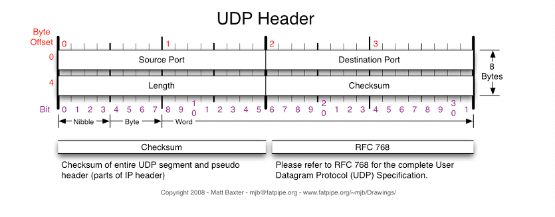

# UDP

> User Datagram Protocol

## UDP 통신이란

---

- 데이터를 데이터그램 단위로 처리하는 프로토콜이다.
- 비연결형, 신뢰성 없는 전송 프로토콜이다.
- 데이터그램 단위로 쪼개면서 전송을 해야하기 때문에 전송 계층이다.
- Transport layer에서 사용하는 프로토콜

## TCP와 UDP가 나오게 된 이유

---

1. IP 역할은 Host to Host(장치 to 장치)만을 지원한다. 장치에서 장치로 이동은 IP로 해결되지만 하나의 장비 안에서 수많은 프로그램들이 통신을 할 경우 IP 만으로는 한계가 존재한다.
2. IP에서 오류가 발생한다면 ICMP에서 알려주지만 ICMP는 오률를 알려주기만 할 뿐 오류에 대한 대처를 하지 못하기에 IP보다 위에서 처리 해줘야할 필요가 있다.
   -> 1번의 문제를 해결하고자 포트 번호가 등장하였고, 2번을 해결하기 위해 상위 프로토콜인 TCP와 UDP가 나오게 되었다.

## TCP와 UDP에서 오류를 해결하는 방법

---

### TCP

-> 데이터의 분실, 중복, 순서가 뒤바뀜 등을 자동으로 보정해줘서 송수신 데이터의 정확한 전달을 할 수 있도록 해준다.

### UDP

-> IP가 제공하는 정도의 수준만을 제공하는 간단한 IP 상위 계층의 프로토콜이다. TCP와 다르게 에러가 날 수도 있고, 재전송이나 순서가 뒤바뀔 수도 있어서 이 경우 어플리케이션에서 처리하는 번거로움이 존재한다.

## UDP를 사용하는 이유

---

- UDP의 장점은 데이터의 신속성이다. 데이터의 처리가 TCP보다 빠르다.
- 주로 실시간 방송과 온라인 게임에서 사용된다.

## DNS에서 UDP를 사용하는 이유

---

- Request 양이 작다 -> UDP Request에 담길 수 있다.
- 3 way handshake로 연결을 유지할 필요가 없다. -> 오버헤드 발생
- Request에 대한 손실은 Application Layer에서 제어가 가능하다.
- DNS: UDP를 port 53번에서 사용한다.
  하지만 크기가 512가 넘을 경우 UDP의 제한을 넘기기 때문에 TCP를 사용해야 한다.

## UDP Header

---

- Source port: 시작 포트
- Destination port: 도착지 포트
- Length: 길이
- Checksum: 오류 검출
  -> 중복 검사의 한 형태로, 오류 정정을 통해 공간이나 시간 속에서 송신된 자료의 무결성을 보호하는 방법이다.

### 참고한 자료

---

- https://gyoogle.dev/blog/computer-science/network/UDP.html
