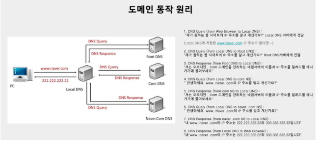

# Server

서버에서는 정해진 html, css, js 파일만 전달해준다.

## 웹 애플리케이션 서버

고객의 세부 요구사항에 따라 페이지를 내려준다.

## 웹 서버 + 웹 애플리케이션 서버

역할 분담이 가능해졌다.

## 스케일 업, 스케일 아웃

클라이언트가 더 늘어난다면 스케일 업을 통해 각 요소들의 성능 자체를 업그레이드 시켜 요청 처리를 향상 시킨다. 스케일 아웃은 각 요소들의 개수를 증가시켜 요청 처리를 향상 시키는 방식이다. 물리적 개수를 증가 시킨다.

## MSA

Micro Service Architecture

각 역할을 담당하는 기능을 하는 서버를 여러 개로 만든다.

도커는 각 서버들을 독립적으로 격리 시켜주는 역할을 담당한다. 쿠버네티스는 독립된 서버들을 생성, 삭제, 관리해주는 매니저 역할을 담당한다.

## 프로토콜

컴퓨터 간의 통신 ⇒ 어떻게 통신하지?

어떻게에 대한 방법을 정의해 놓은 것, 컴퓨터 간 통신에 필요한 규약, 양식

프로토콜에는 대표적인 방식 2가지가 있다.

OSI 모델 & TCP/IP 모델

두 모델의 차이는 OSI 모델은 7계층으로 이루어져 있고, 네트워크 장비를 기준으로 한다.

TCP/IP는 4계층으로 구성되어 있고, 실제 통신 기준이다.

## 네트워크

2개 이상의 컴퓨터들이 전송매체를 통해 서로 연결된 모임

## IP, 도메인, PORT

IP는 IT 환경의 주소 체계이다.

도메인은 IP 주소를 인식하기 쉬운 주소로 바꾼 주소

## 서브 도메인

하나의 도메인으로 부가적인 여러 도메인을 사용할 수 있다.

ex) [blog.naver.com](http://blog.naver.com/), [mail.naver.com](http://mail.naver.com/), [finance.naver.com](http://finance.naver.com/)

## PORT

하나의 컴퓨터 내에서 하나의 프로그램과 통신하기 위한 통로, 포트번호는 프로그램당 하나만 사용할 수 있다.

http: 80번 포트

https: 433번 포트

FTP: 21번 포트 → 파일 전송에 사용

SFTP: 22번 포트 → 파일전송에 사용(보안강화)

MYSQL: 3306 ⇒ mysql db서버에서 사용

## 리다이렉션

받은 요청을 다시 지시하여 새로운 요청으로 지시하는 것

http로 요청해도 https로 리다이랙트 된다.

## 공인 IP, 사설 IP

공인 IP는 ISP(인터넷 서비스 공급자)가 제공해주는 IP 주소

사설 IP는 일반 가정이나 회사 내에 할당된 네트워크 IP 주소

공인 IP 하나로 여러 개의 사설 IP를 배정할 수 있다.

## IPv4 & IPv6

## 포트포워딩

네트워크 게이트웨이(공유기)를 가로 지르는 동안 하나의 IP 주소와 포트 번호 결합의 통신 요청을 다른 곳으로 넘겨주는 작업

NAT 테이블에 포트포워딩 설정

## NAT

사설 IP를 공인 IP로 변경하는데 필요한 주소 변환 서비스 다수의 사설 IP를 하나의 공인 IP 주소로 변환하는 기술

## 클라우드 서비스

유연성과 확장성이 장점이다.

인프라형 서비스(IaaS), 플랫폼형 서비스(Paas), 소프트웨어형 서비스(SaaS)

## EC2

AWS 클라우드에서 제공하는 확장 가능한 컴퓨팅 서비스, 하나의 컴퓨터(서버)를 대여해준다.

## RDS

AWS 클라우드에서 제공하는 데이터벳이스 서버 하나의 데이터베이스를 대여

RDS를 사용하면 안정성, 보안성, 확장성의 장점이 있다. 서버와 db 서버를 분리

## S3

AWS 클라우드에서 스토리지 서비스, 하나의 저장 공간을 대여

값싼 가격에 큰 크기의 파일을 저장할 수 있게 된다.

## 운영체제

## 리눅스

### 리눅스 특징

리눅스 파일 구조는 역 트리 형태로 구성되어 있다. 루트 폴더가 최상위에 온다. 디렉토리마다 저장하고 있는 파일의 역할이 정해져 있다.
